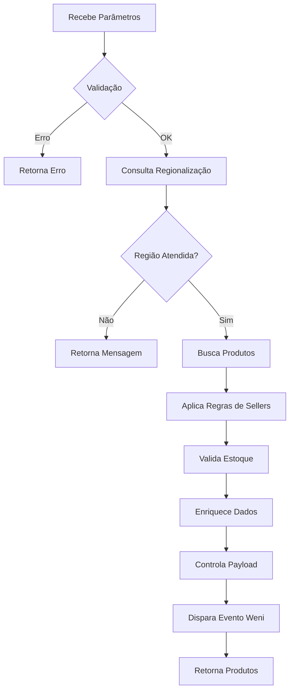

# Exemplo: Agente de Busca de Produtos com Regionalização

## 📋 Descrição

Este agente busca produtos da VTEX aplicando regionalização por CEP, validação de estoque e regras de negócio específicas (ex: priorização por categoria, sellers regionais).

## 🎯 Funcionalidades

- ✅ Busca produtos por nome e marca (opcional)
- ✅ Filtra por CEP usando API de regionalização
- ✅ Valida disponibilidade em estoque via simulação de carrinho
- ✅ Aplica regras de sellers regionais
- ✅ Prioriza produtos por estoque em categorias específicas
- ✅ Controla tamanho do payload (máx 20KB)
- ✅ Dispara evento no Weni Flow

## 📥 Parâmetros de Entrada

| Parâmetro | Tipo | Obrigatório | Descrição |
|-----------|------|-------------|-----------|
| product_name | string | ✅ | Nome ou termo de busca do produto |
| postal_code | string | ✅ | CEP para regionalização (com ou sem hífen) |
| brand_name | string | ❌ | Marca específica (filtro opcional) |
| quantity | integer | ❌ | Quantidade desejada (padrão: 1) |
| deliverytype | string | ❌ | "Retirada" ou "Entrega" (obrigatório para categorias prioritárias em algumas regiões) |

## 📤 Estrutura de Resposta

### Sucesso com Produtos:

```json
{
  "Porcelanato Polido 60x60cm": {
    "description": "Porcelanato polido de alta qualidade...",
    "brand": "Portobello",
    "categories": ["/Pisos e Revestimentos/Porcelanatos/"],
    "specification_groups": [
      {
        "name": "Características",
        "specifications": [
          {"name": "Dimensão", "values": ["60x60cm"]},
          {"name": "Acabamento", "values": ["Polido"]}
        ]
      }
    ],
    "variations": [
      {
        "sku_id": "123456",
        "sku_name": "Porcelanato Polido 60x60cm Branco",
        "imageUrl": "https://...",
        "price": 89.90,
        "spotPrice": 79.90,
        "quantity": 150,
        "seller_id": "lojaobramax1000",
        "PackagedHeight": 10,
        "PackagedLength": 60,
        "PackagedWidth": 60,
        "PackagedWeightKg": 15.5,
        "minQuantity": 10,
        "valueAtacado": 75.00
      }
    ]
  }
}
```

### Região Não Atendida:

```json
{
  "region_message": "Informe ao cliente que não atendemos a sua região, mas o cliente pode comprar presencialmente em nossas lojas físicas."
}
```

## 🔧 Implementação Simplificada

```python
from weni import Tool
from weni.context import Context
from weni.responses import TextResponse
import requests
import json

class SearchProduct(Tool):
    def __init__(self):
        super().__init__()
        self._weni_flow_triggered = False
    
    def run(self, context: Context):
        # 1. Extração de parâmetros
        product_name = context.params.get("product_name")
        postal_code = context.params.get("postal_code")
        brand_name = context.params.get("brand_name")
        quantity = int(context.params.get("quantity", 1))
        deliverytype = context.params.get("deliverytype")
        
        # 2. Validação de obrigatórios
        if not product_name or not postal_code:
            return TextResponse(data={
                "error": "Parâmetros obrigatórios: product_name e postal_code"
            })
        
        # 3. Extração de secrets
        base_url = context.secrets.get("BASE_URL")
        store_url = context.secrets.get("STORE_URL")
        vtex_appkey = context.secrets.get("VTEX_APPKEY")
        vtex_apptoken = context.secrets.get("VTEX_APPTOKEN")
        
        # 4. Regionalização
        region_id, error_msg, sellers = self.get_region_id(postal_code, base_url)
        
        if error_msg:
            return TextResponse(data={"region_message": error_msg})
        
        # 5. Busca de produtos
        products = self.intelligent_search(
            product_name, brand_name, store_url, region_id
        )
        
        # 6. Validação de estoque
        products_with_stock = self.validate_stock(
            base_url, products, sellers, quantity, postal_code
        )
        
        # 7. Enriquecimento de dados
        enriched_products = self.enrich_products(
            products_with_stock, base_url, vtex_appkey, vtex_apptoken
        )
        
        # 8. Controle de payload
        final_products = self.control_payload_size(enriched_products)
        
        # 9. Dispara evento Weni
        self.trigger_weni_flow(context)
        
        # 10. Retorno
        return TextResponse(data=final_products)
    
    def get_region_id(self, postal_code, base_url):
        """Consulta API de regionalização"""
        # [Implementação completa na seção de APIs]
        pass
    
    def intelligent_search(self, product_name, brand_name, url, region_id):
        """Busca produtos via Intelligent Search"""
        # [Implementação completa na seção de APIs]
        pass
    
    def validate_stock(self, base_url, products, sellers, quantity, postal_code):
        """Valida estoque via cart simulation"""
        # [Implementação completa na seção de APIs]
        pass
```

## 🎓 Regras de Negócio Especiais

### 1. Categorias Prioritárias

Produtos de certas categorias devem ser ordenados por maior estoque disponível:

```python
PRIORITY_CATEGORIES = [
    "/Pisos e Revestimentos/Pisos Cerâmicos/",
    "/Pisos e Revestimentos/Porcelanatos/",
    "/Pisos e Revestimentos/Revestimentos Cerâmicos/"
]

def is_priority_category(self, categories):
    """Verifica se produto está em categoria prioritária"""
    if not categories:
        return False
    
    for category in categories:
        if category in PRIORITY_CATEGORIES:
            return True
    
    return False
```

### 2. Sellers Regionais (Exemplo: Mooca)

Para a região da Mooca, há sellers específicos por tipo de entrega em categorias prioritárias:

```python
def apply_mooca_rules(self, sellers, is_priority, deliverytype):
    """
    Aplica regras dos sellers da Mooca
    
    Retirada: lojaobramax1000, lojaobramax1003
    Entrega: lojaobramax1000, lojaobramax1500
    """
    mooca_sellers = ["lojaobramax1000", "lojaobramax1003", "lojaobramax1500"]
    
    # Verifica se são sellers da Mooca
    if not all(s in mooca_sellers for s in sellers):
        return sellers
    
    # Se categoria prioritária, deliverytype é obrigatório
    if is_priority:
        if not deliverytype:
            raise ValueError(
                "Para produtos de pisos e porcelanatos na região da Mooca, "
                "é necessário informar o tipo de entrega (Retirada ou Entrega)."
            )
        
        if deliverytype == "Retirada":
            return ["lojaobramax1000", "lojaobramax1003"]
        elif deliverytype == "Entrega":
            return ["lojaobramax1000", "lojaobramax1500"]
    
    # Se não é prioritária, usa seller que atende ambos
    return ["lojaobramax1000"]
```

### 3. Controle de Tamanho de Payload

Limita resposta a 20KB removendo produtos excedentes:

```python
def control_payload_size(self, products, max_kb=20):
    """
    Garante que payload não exceda o limite
    
    Args:
        products: Lista de produtos
        max_kb: Tamanho máximo em KB (padrão: 20)
    
    Returns:
        list: Produtos dentro do limite
    """
    json_data = json.dumps(products)
    size_kb = len(json_data.encode('utf-8')) / 1024
    
    print(f"INFO: Tamanho inicial: {size_kb:.2f} KB, {len(products)} produtos")
    
    if size_kb > max_kb:
        print(f"WARN: Payload excede {max_kb}KB, reduzindo...")
        
        while size_kb > max_kb and products:
            products.pop()
            json_data = json.dumps(products)
            size_kb = len(json_data.encode('utf-8')) / 1024
        
        print(f"INFO: Tamanho final: {size_kb:.2f} KB, {len(products)} produtos")
    
    return products
```

## 🧪 Exemplos de Uso

### Exemplo 1: Busca Simples

**Input:**
```json
{
  "product_name": "cimento",
  "postal_code": "01310-100"
}
```

**Output:** Lista de cimentos disponíveis na região.

### Exemplo 2: Busca com Marca

**Input:**
```json
{
  "product_name": "porcelanato 60x60",
  "postal_code": "03164-100",
  "brand_name": "Portobello"
}
```

**Output:** Porcelanatos 60x60 da marca Portobello.

### Exemplo 3: Categoria Prioritária (Mooca)

**Input:**
```json
{
  "product_name": "porcelanato polido",
  "postal_code": "03103-010",
  "deliverytype": "Entrega"
}
```

**Output:** Porcelanatos disponíveis nos sellers de entrega da Mooca.

## 📊 Fluxo de Execução



## 🔍 Debugging

### Logs Importantes

```python
print(f"DEBUG: Consultando regionalização - CEP: {postal_code}")
print(f"DEBUG: Region ID: {region_id}, Sellers: {sellers}")
print(f"DEBUG: Busca inteligente retornou {len(products)} produtos")
print(f"DEBUG: Categoria prioritária: {is_priority}")
print(f"DEBUG: Produtos com estoque: {len(products_with_stock)}")
print(f"INFO: Tamanho do payload: {size_kb:.2f} KB")
```

## 📚 Recursos Relacionados

- [Guia de APIs VTEX](../03-apis-integracoes.md#integracao-vtex)
- [Padrões de Resposta](../02-padroes-boas-praticas.md#padroes-de-resposta)
- [Estrutura de Projetos](../01-estrutura-projetos.md)
